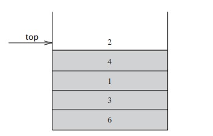

# Lab 05: Stacks!

## 1. Introduction

Today you will implement a stack (similar to Lab 4 where you implemented a Linked List), and compare it to the STL stack.

1. [Introduction](#1-introduction)
2. [Pointer Review](#2-stl_stacks)
3. [Your Turn!](#3-your_turn)
4. [Starter Code](#4-starter_code)
5. [Submission](#5-submission)

## 2. STL & Stacks

The STL (Standard Template Library) is a library of data structures for storing data. There are several data structures included in this library each with their own advantages and disadvantages. One of the data structures within the STL library are stacks.

Stacks are sometimes known as LIFO (last in, first out) lists. Stacks are a handy stand-in for dynamic arrays in C++, and are extremely useful when we want to ensure data is either inserted or deleted in only one position. This position is referred to the **top** of the stack. If you struggle to remember a stack's enforced ordering, a useful mnemonic can be a *stack* of pancakes. As you cook pancakes, you stack them newest on top, and you expect whomever you are cooking for to remove them from the top. Otherwise they are savage barbarians who just made a mess by throwing pancakes all over the table in their hunt for the pancakes at the bottom, and deserve no pancakes.



> Fig 2.0 An example of a Stack. The figure above displays how the array: 6, 3, 1, 4, and 2 would appear if it was inserted, from the start of the array, into a stack.

#### 2.1 Understanding Stacks Fundamental Operations

The fundamental operations that can be performed on a stack and push, pop and top.

**push** is the equivalent to "insert" except it *inserts an item to the top* of the stack.

**pop** is equivalent to "delete" except it *deletes an item from the top* of the stack.

**top** will *return the element* that is at the *top* of the stack.

#### 2.2 Utility Stack Operations

**size** will return the *quantity* of elements in the stack.

**empty** returns *true* if there are 0 elements, *false* otherwise.

#### 2.3 STL Stack Syntax

**Stack Initialization**

```
#include <stack>

int main() {
	std::stack<int> vec;
}
```

**Push & Pop**

```
#include <iostream>
#include <stack>

int main () {

  std::stack<int> myStack;

  for (int i = 1; i <= 5; i++){
        myStack.push(i);
  } 

  std::cout << "Popping out elements...";
  while (!myStack.empty()) {
     std::cout << ' ' << myStack.top();
     myStack.pop();

  }

  std::cout << std::endl;

  return 0;
}
```

**Output:**

> Popping out elements... 5 4 3 2 1

**Top**

```
#include <iostream>
#include <stack>

int main () {
  std::stack<int> myStack;

  myStack.push(10);
  myStack.push(20);

  myStack.top() -= 5;

  std::cout << "myStack.top() is now " << myStack.top() << std::endl;

  return 0;
}
```

**Output:**

> myStack.top() is now 15

**Empty**

```
#include <iostream>
#include <stack>

int main () {
  std::stack<int> myStack;
  int sum (0);

  for (int i=1 ; i <= 10 ; i++) {
      myStack.push(i);
  } 

  while (!myStack.empty()) {
     sum += myStack.top();
     myStack.pop();
  }

  std::cout << "Total: " << sum << std::endl;

  return 0;
}
```

**Output:**

> Total: 55

**Size**

```
#include <iostream>
#include <stack>

int main () {
  std::stack<int> myStack;
  std::cout << "0. Size: " << myStack.size() << '\n';

  for (int i = 1; i <= 5; i++){
        myStack.push(i);
  } 
  std::cout << "1. Size: " << myStack.size() << '\n';

  myStack.pop();
  std::cout << "2. Size: " << myStack.size() << '\n';

  return 0;
}
```

**Output:**

> 1. size: 0
> 2. size: 5
> 3. size: 4

## 3. Your turn!

As promised at the beginning of this lab, you will be implementing your own version of the STL Stack class. Your goal is to be able to perform all of the above tests on your own version of the stack, and see how your implementation *stacks up* (hahaha) against the STL's version. After 

## 4. Starter Code

You are given the skeleton for a Stack class; implement all of the prototyped functions in *stack.cpp* and come up with a way to compare your solution to the STL stack. 

##### node.h

```c++
class Node{
    private:
        int data;
        Node* next;

        friend class Stack;
    public:
        Node();
        ~Node();
        Node(int data);
        Node(int data, Node* next);
};
```

##### node.cpp

```c++
#include "node.h"

Node::Node(){
    this->data = 0;
    this->next = nullptr;
}

Node::~Node(){
    if(this->next != nullptr){
        delete this->next;
    }
}

Node::Node(int data){
    this->data = data;
    this->next = nullptr;
}

Node::Node(int data, Node* next){
    this->data = data;
    this->next = next;
}
```


##### stack.h

```c++
#include "node.h"

class Stack{
	private:
		Node* head;
		int _size;
	public:
		Stack();
		~Stack();
		void push(int data);
		void pop();
		int& top();
		int size();
		bool empty();
};
```


Since the goal is to re-implement the STL stack, we want our implementation to behave *exactly* the same. If you are unsure of how a particular function is meant to behave, you may read up on it here: http://www.cplusplus.com/reference/stack/stack/

## 5. Submission

Your **Gradescope** submission for this lab will include your Stack implementation (*node.h*, *node.cpp*, *stack.h*, *stack.cpp*), as well as your *main.cpp* file containing your implementation of STL Stack as well as your performance comparison.